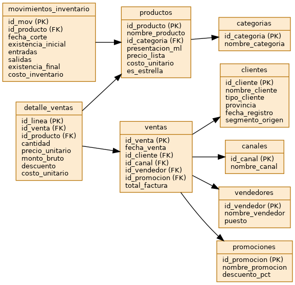
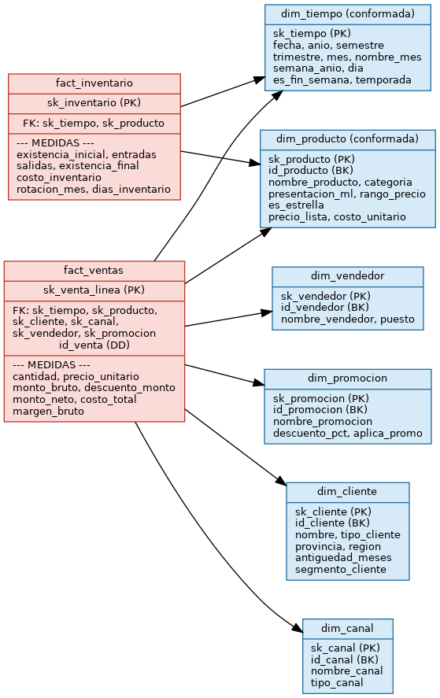
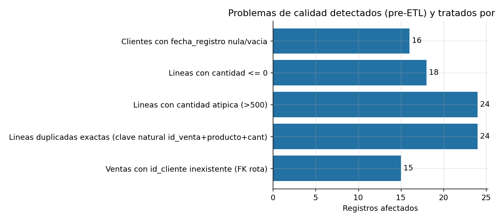
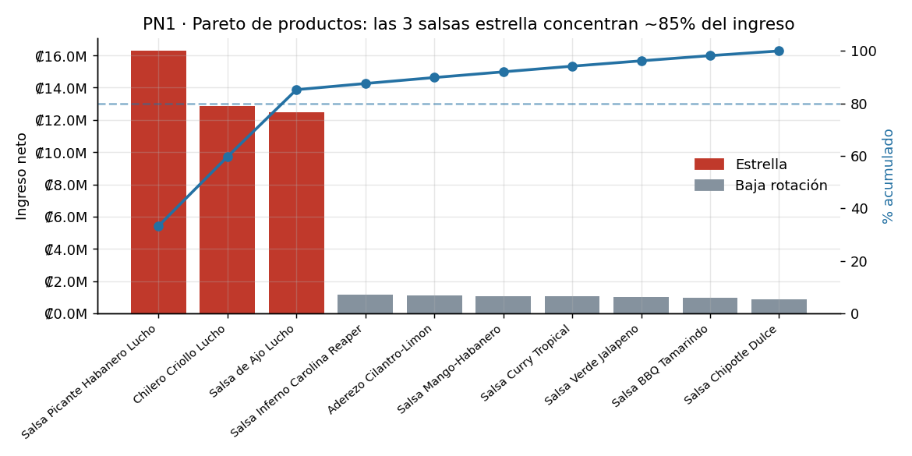
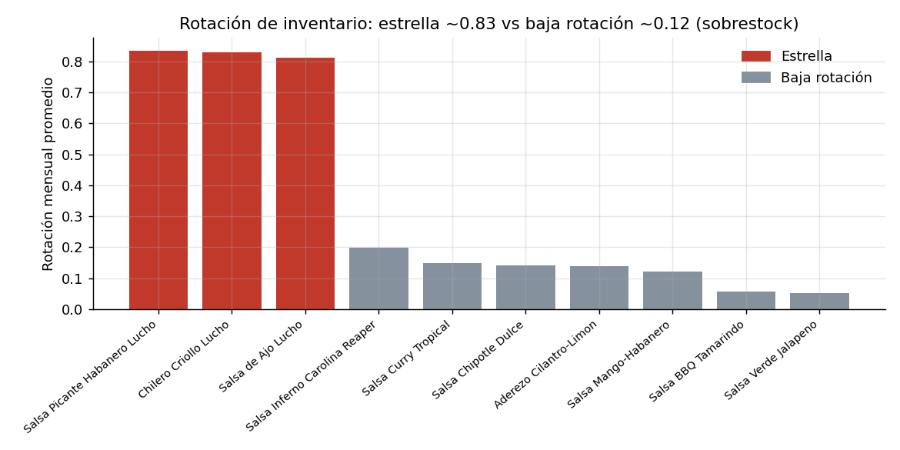
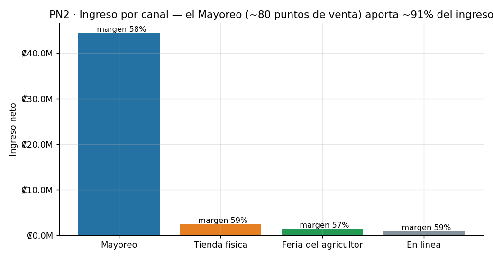
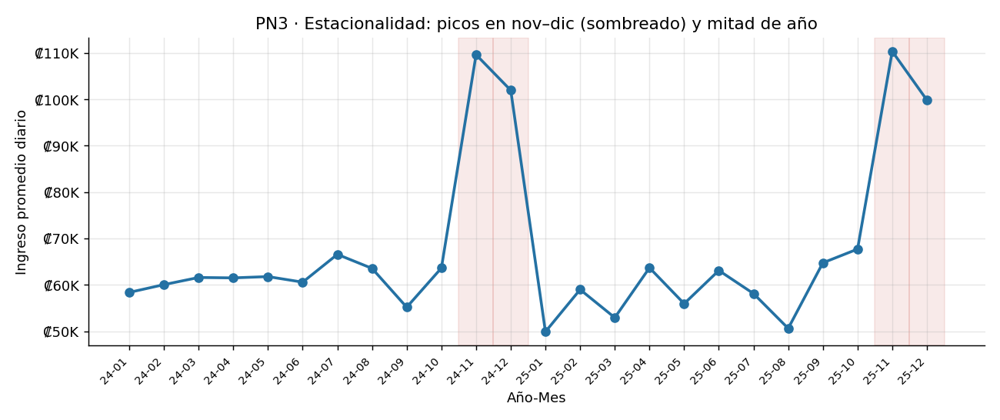
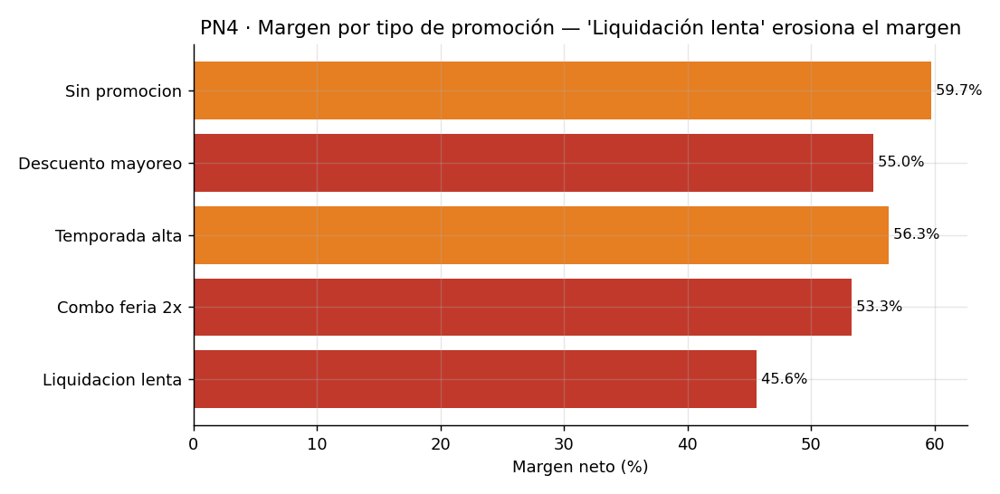
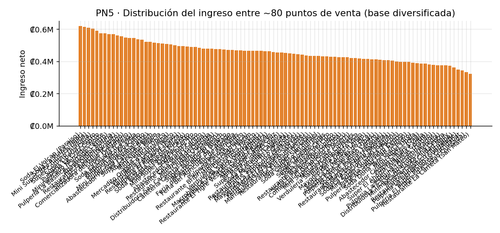

\newpage

# Portada

**Tecnológico de Costa Rica — Administración de Tecnología de Información**

**Curso:** Inteligencia de Negocios

**Proyecto 02:** Diseño e implementación de una solución integral de Inteligencia de Negocios

**Organización analizada:** Las Salsas de Lucho (PYME comercial de salsas artesanales, Cartago, Costa Rica)

**Estudiante:** Gerom Watson Araya — carné 2017168284

**Fecha de entrega:** 02/06/2026

\newpage

# 1. Resumen ejecutivo

Las Salsas de Lucho es una microempresa costarricense que produce y comercializa
salsas artesanales en presentación de **200 ml a un precio de venta de ₡3.000**. Su
catálogo combina **tres salsas insignia de alta rotación** con siete variedades de
especialidad lanzadas recientemente que rotan poco. El negocio coloca su producto
principalmente por **mayoreo en cerca de 80 puntos de venta** (pulperías, mini
súper, sodas, restaurantes y ferias distribuidos por todo el país) y, en menor
medida, por tienda física, ferias del agricultor y pedidos en línea. Antes de este
proyecto carecía de visibilidad sobre la rentabilidad real de su surtido, sus
canales y su inventario, y tomaba decisiones de producción y compra por intuición.

Este proyecto entrega una solución integral de Inteligencia de Negocios: una fuente
operacional documentada, un **modelo dimensional en estrella** con dos tablas de
hechos y seis dimensiones, un **proceso ETL reproducible** en Python sobre
PostgreSQL con diez reglas de transformación, y un **tablero analítico** de seis
vistas que responde cinco preguntas de negocio.

Sobre dos años de operación (2024–2025), el negocio mueve **≈₡2,03 millones de
ingreso neto al mes** y una **utilidad (margen bruto) de ≈₡1,17 millones al mes**
(margen ≈57,6 %), con un promedio de **≈80 puntos de venta activos cada mes**. Los
hallazgos principales confirman y cuantifican las sospechas del propietario:

- Las **3 salsas estrella concentran el 85,2 % del ingreso** neto (Habanero 33,3 %,
  Chilero Criollo 26,4 % y de Ajo 25,5 %); las siete variedades restantes aportan
  en conjunto menos del 15 %.
- El **canal Mayoreo genera el 90,9 % del ingreso** (₡44,4 M) a través de los ~80
  puntos de venta; los canales directos (tienda, feria, en línea) suman menos del
  10 %. Los márgenes son similares entre canales (57–59 %).
- Los productos de baja rotación tienen una **rotación mensual de ≈0,12 frente a
  ≈0,83 de las estrella**, acumulando del orden de **390 días de inventario** (más
  de un año): capital inmovilizado y riesgo de merma.
- La promoción **"Liquidación lenta" destruye margen** (45,6 % frente al 59,7 %
  de las ventas sin promoción) sin generar volumen relevante.
- El ingreso de mayoreo está **bien repartido entre los ~80 puntos** (los 5 mayores
  clientes apenas suman 6,8 %): **no hay dependencia de pocos clientes**, pero sí una
  fuerte **dependencia del canal mayoreo (91 %) y de 3 productos (85 %)**.

# 2. Descripción de la organización

**Las Salsas de Lucho** es una PYME del sector de alimentos fundada en 2021 en
Cartago. Elabora salsas y aderezos de forma artesanal en botellas de **200 ml** y
los comercializa por cuatro canales: **mayoreo** a una red de pulperías, mini súper,
sodas y restaurantes (su canal principal), su **tienda física**, **ferias del
agricultor**, y **pedidos en línea** por redes y mensajería. La operación la lidera
el propietario, Luis "Lucho" Mora, con apoyo de un pequeño equipo de ventas. El
registro de ventas se realiza en un sistema de facturación sencillo complementado
con hojas de cálculo, lo que introduce problemas de calidad de datos (nombres
inconsistentes, registros incompletos y errores de digitación).

# 3. Descripción del problema y justificación

El propietario enfrenta tres preguntas que hoy responde por intuición: qué
productos y canales realmente dejan utilidad, cuánto inventario lento está
acumulando, y cómo planificar la producción ante la estacionalidad. La ausencia de
información consolidada provoca **sobre-producción de variedades que no rotan**,
**riesgo de vencimiento**, y decisiones de promoción que erosionan el margen.

La justificación del proyecto es directa: con los mismos datos que el negocio ya
genera, una solución de BI permite reorientar el surtido, la producción y la
política comercial hacia las líneas y canales rentables. El caso es **rico en
datos** (ventas con múltiples entidades relacionadas, histórico de dos años, ~80
puntos de venta, variables categóricas y numéricas, e inventario), lo que lo hace
idóneo para un proyecto de BI.

\newpage

# 4. Acta constitutiva del proyecto

Elaborada siguiendo lineamientos del **PMBOK** (acta de constitución / *project charter*).

| Campo | Contenido |
|---|---|
| **Nombre del proyecto** | Solución de Inteligencia de Negocios para Las Salsas de Lucho |
| **Organización** | Las Salsas de Lucho — PYME comercial de salsas artesanales (Cartago, CR) |
| **Descripción del problema** | Falta de visibilidad sobre rentabilidad de productos y canales, sobre-inventario de productos lentos y decisiones de producción/promoción sin sustento de datos. |
| **Justificación** | Reorientar surtido, producción y política comercial hacia las líneas y canales rentables a partir de los datos que el negocio ya genera. |
| **Objetivo general** | Diseñar e implementar una solución integral de BI que permita analizar ventas e inventario y responder cinco preguntas de negocio. |
| **Objetivos específicos** | (1) Documentar la fuente operacional. (2) Diseñar un modelo dimensional en estrella. (3) Implementar un ETL reproducible con validación de calidad. (4) Construir un tablero analítico. (5) Generar hallazgos y recomendaciones accionables. |
| **Alcance** | Ventas e inventario 2024–2025; modelo dimensional, ETL, tablero de 6 vistas e informe. |
| **Exclusiones** | Contabilidad, planilla, costos indirectos, integración con sistemas externos, datos posteriores a 2025. |
| **Partes interesadas** | Propietario (patrocinador y usuario principal), equipo de ventas (usuarios), equipo del proyecto, persona docente. |
| **Roles del equipo** | Product Owner (enlace con el cliente), Scrum Master, Ingeniero de datos/ETL, Modelador dimensional, Desarrollador del tablero. *(Asignar nombres del grupo.)* |
| **Cronograma general** | Sprint 1 (requerimientos y fuente), Sprint 2 (modelo y ETL), Sprint 3 (tablero, validación y documentación). |
| **Premisas** | Los datos entregados son representativos; el negocio mantiene los cuatro canales; la moneda es el colón costarricense; el precio de venta es ₡3.000 por botella de 200 ml. |
| **Restricciones** | Datos anonimizados; herramienta de ETL distinta de Power BI/Tableau; trabajo desde cero durante el curso. |
| **Riesgos** | Calidad deficiente de los datos de origen; dependencia del canal mayoreo; alcance creciente. |
| **Metodología** | Scrum adaptado a 3 sprints. |
| **Criterios de aceptación** | El tablero responde las 5 preguntas de negocio; el ETL es reproducible; trazabilidad fuente→ETL→modelo→tablero. |
| **Validación del alcance** | Entrevista de levantamiento (14/04/2026) y minuta de validación (28/04/2026); carta de aceptación firmada por el propietario. |

# 5. Objetivos del proyecto

**Objetivo general.** Diseñar, implementar y documentar una solución integral de
Inteligencia de Negocios para Las Salsas de Lucho que convierta sus datos de ventas
e inventario en decisiones accionables.

**Objetivos específicos.**

1. Documentar y modelar la fuente operacional transaccional del negocio.
2. Diseñar e implementar un modelo dimensional en estrella orientado al análisis.
3. Construir un proceso ETL reproducible con validación de calidad de datos y al
   menos cinco reglas de transformación no triviales.
4. Desarrollar un tablero analítico que responda las preguntas de negocio.
5. Generar hallazgos, conclusiones y recomendaciones para el propietario.

# 6. Preguntas de negocio e indicadores clave

| # | Pregunta de negocio | Indicadores asociados |
|---|---|---|
| PN1 | ¿Qué productos concentran ventas y margen, y cuáles son de baja rotación? | Ingreso neto y margen por producto, % de participación, rotación de inventario. |
| PN2 | ¿Qué canal es más rentable y cómo evoluciona en el tiempo? | Ingreso y margen % por canal, evolución mensual. |
| PN3 | ¿Cómo se comporta la estacionalidad de la demanda? | Ingreso promedio diario por mes, ingreso por temporada y día de semana. |
| PN4 | ¿Las promociones ayudan o erosionan el margen? | Margen % y tasa de descuento por tipo de promoción. |
| PN5 *(exploratoria)* | ¿Hay dependencia de pocos clientes o de un canal, y cómo es la geografía de los puntos de venta? | Concentración de ingreso por cliente y por canal, ingreso por provincia/región. |

Los KPIs (≥17) están definidos en el **diccionario de datos** (`docs/diccionario_datos.md`).

# 7. Metodología de trabajo — Scrum adaptado

El equipo aplicó una adaptación de **Scrum** a tres sprints de dos semanas, justificada
por el tamaño del grupo y la duración del curso:

- **Sprint 1 — Comprensión y fuente.** Levantamiento de requerimientos (entrevista
  y minuta), acta constitutiva, diseño y documentación de la fuente operacional.
- **Sprint 2 — Modelo y ETL.** Diseño del modelo dimensional, implementación del
  ETL con validación de calidad y carga del almacén.
- **Sprint 3 — Analítica y cierre.** Construcción del tablero, validación con el
  cliente, hallazgos y documentación.

Cada sprint cerró con una revisión. El trabajo se gestionó con un tablero de
producto (backlog → en progreso → hecho) y el repositorio **GitHub** evidencia la
colaboración mediante commits significativos de cada integrante.

\newpage

# 8. Fuente operacional

La fuente operacional replica la base transaccional del negocio. Está compuesta por
nueve entidades relacionadas con histórico de dos años, variables categóricas y
numéricas, e incluye **problemas de calidad reales** (nombres inconsistentes, nulos,
duplicados, errores de digitación y llaves foráneas rotas). Los datos son sintéticos
y anonimizados, generados de forma reproducible con semilla fija.

| Entidad | Filas | Descripción |
|---|---:|---|
| categorias | 3 | Familias de producto. |
| productos | 10 | 3 estrella + 7 de baja rotación, todas 200 ml a ₡3.000. |
| clientes | 137 | ~96 puntos de venta (mayoreo) + "Cliente Contado" + minoristas. |
| canales | 4 | Tienda física, feria, mayoreo, en línea. |
| vendedores | 4 | Equipo de ventas. |
| promociones | 5 | Tipos de promoción/descuento. |
| ventas | 3 655 | Encabezados de factura. |
| detalle_ventas | 5 055 | Líneas de factura (grano del hecho). |
| movimientos_inventario | 240 | Snapshot mensual por producto. |

## 8.1 Diagrama del modelo operacional (transaccional)



# 9. Modelo dimensional

A partir de los requerimientos se diseñó un **esquema estrella** con dos tablas de
hechos que comparten dimensiones conformadas (constelación de hechos), justificado
porque el negocio necesita analizar tanto el flujo de ventas como el estado del
inventario con las mismas dimensiones de tiempo y producto.



## 9.1 Granularidad, hechos, dimensiones, jerarquías y medidas

**Granularidad.**

- `fact_ventas`: **una línea de detalle de factura** (un producto dentro de una venta).
- `fact_inventario`: **un snapshot mensual por producto**.

**Tablas de hechos.** `fact_ventas` (4 989 filas tras el ETL) y `fact_inventario`
(240 filas).

**Dimensiones (6).** `dim_tiempo` y `dim_producto` son **conformadas** (compartidas
por ambos hechos); además `dim_cliente`, `dim_canal`, `dim_vendedor` y
`dim_promocion`. Todas usan **llave subrogada** independiente de la llave de negocio.

**Jerarquías.**

- Tiempo: Año → Semestre → Trimestre → Mes → Semana → Día.
- Producto: Categoría → Producto.
- Geografía (cliente): Región → Provincia.

**Medidas.** El modelo documenta más de 12 medidas (ver §6 del diccionario):
unidades, ingreso bruto/neto, descuentos, costo, margen (₡ y %), ticket promedio,
número de facturas, precio promedio, tasa de descuento, participación de producto,
rotación y días de inventario, valor de inventario, entre otras.

El **diccionario de datos** completo (todas las tablas, columnas, tipos y medidas)
se incluye en `docs/diccionario_datos.md`.

\newpage

# 10. Diseño e implementación del ETL

El ETL se implementó en **Python (pandas + SQLAlchemy)** y es **reproducible** y
**trazable** desde la fuente operacional hasta el modelo dimensional. Consta de tres
pasos orquestados por `etl/run_pipeline.py`:

1. **`cargar_operacional.py`** — carga los CSV crudos a la base operacional `salsas_op`.
2. **`calidad_datos.py`** — perfila la calidad **antes** del ETL y emite un reporte.
3. **`etl_pipeline.py`** — extrae de `salsas_op`, aplica las reglas R1–R10 y carga `salsas_dw`.

## 10.1 Validación de calidad de datos (pre-ETL)

El perfilado detectó los siguientes problemas, que las reglas del ETL corrigen:



| Dimensión de calidad | Hallazgo | Registros |
|---|---|---:|
| Completitud | Clientes con fecha de registro nula | 16 |
| Completitud | Ventas con canal nulo/vacío | 40 |
| Completitud | Líneas con costo unitario nulo | 215 |
| Validez | Líneas con cantidad ≤ 0 (devoluciones mal registradas) | 18 |
| Validez | Líneas con cantidad atípica (errores de digitación) | 24 |
| Unicidad | Líneas duplicadas exactas | 24 |
| Integridad | Ventas con cliente inexistente (FK rota) | 15 |
| Consistencia | Variantes de texto en provincia y canal | 23 / 19 |

## 10.2 Reglas de transformación (documentación del ETL)

La siguiente tabla documenta las transformaciones aplicadas (formato campo destino /
campo origen / regla / comentarios):

| Campo destino | Campo origen | Regla aplicada | Comentarios |
|---|---|---|---|
| `dim_tiempo.*` | `ventas.fecha_venta` | **R1** Derivación de año, semestre, trimestre, mes, semana, día y temporada. | Dimensión de tiempo obligatoria. |
| `dim_*.sk_*` | llaves de negocio | **R2** Generación de llaves subrogadas secuenciales. | Independientes del sistema de origen. |
| `dim_cliente.provincia` / `dim_canal.nombre_canal` / `dim_producto.nombre_producto` | textos "sucios" de origen | **R3** Homologación de catálogos (trim, mayúsculas, mapeo de variantes a valor canónico). | Reduce 23 variantes de provincia y 19 de canal a valores canónicos. |
| `dim_cliente.antiguedad_meses` | `clientes.fecha_registro` | **R4** Cálculo de antigüedad; nulos imputados por la mediana. | 16 nulos imputados. |
| `dim_cliente.segmento_cliente` | `ventas` (frecuencia y recencia) | **R5** Segmentación RFM simplificada (Nuevo/Recurrente/Frecuente/Inactivo). | — |
| *(filtrado de filas)* | `detalle_ventas.cantidad` | **R6** Detección de outliers por canal (regla IQR, piso 50 uds). | 24 errores de digitación (999, 9999) descartados; se conserva el mayoreo legítimo. |
| *(filtrado de filas)* | `detalle_ventas` | **R7** Deduplicación por clave natural (venta+producto+cantidad+precio). | 24 duplicados eliminados. |
| `fact_ventas.monto_neto` | `detalle_ventas.monto_bruto, descuento` | **R8** Recálculo de monto bruto = precio×cantidad, neto = bruto − descuento, validación de signos. | 18 líneas con cantidad ≤ 0 descartadas. |
| `fact_ventas.costo_total` | `detalle_ventas.costo_unitario` | **R8** Imputación de costo nulo desde el catálogo de productos. | 212 costos imputados. |
| `fact_ventas.margen_bruto` | neto − costo | **R8** Derivación de medida de margen. | — |
| `fact_ventas.sk_cliente` | `ventas.id_cliente` | **R9** Validación de integridad referencial; FK rota → miembro "No identificado". | 17 líneas reasignadas. |
| *(todas)* | tipos de origen (texto) | **R10** Tipado y estandarización de formatos (fechas ISO, moneda numérica). | — |

## 10.3 Evidencia de ejecución

La ejecución del pipeline produce bitácoras en `evidencia/etl_logs/`
(`reporte_calidad.csv/.md`, `bitacora_etl.csv` y los `.log` de cada paso). Salida
real de la corrida:

```
Extraidas 3655 ventas, 5055 lineas, 137 clientes
R1  | dim_tiempo construida (dias de calendario)            |    731
R7  | Deduplicacion de lineas de venta                      |     24
R8  | Lineas con cantidad <=0 descartadas                   |     18
R6  | Outliers de cantidad descartados (IQR por canal)      |     24
R8  | Costo unitario nulo imputado desde catalogo           |    212
R9  | Lineas con cliente inexistente -> No identificado     |     17
Cargada dw.dim_tiempo       731 filas
Cargada dw.fact_ventas     4989 filas
Cargada dw.fact_inventario  240 filas
ETL finalizado. fact_ventas=4989, fact_inventario=240
```

\newpage

# 11. Solución analítica (tablero)

La solución analítica se implementó en **Streamlit + Plotly** (`dashboard/app.py`),
con **seis vistas temáticas**, segmentadores por **año, canal y categoría** en todas
las vistas, KPIs, navegación lateral y visualizaciones apropiadas a cada pregunta.
Las seis vistas son: (1) Resumen ejecutivo, (2) Productos y rotación, (3) Canales y
vendedores, (4) Estacionalidad, (5) Promociones, (6) Clientes y geografía. Cada
vista contiene al menos cinco objetos visuales.

# 12. Respuesta a las preguntas de negocio

## PN1 · Mix de producto y baja rotación

Las tres salsas estrella (**Picante Habanero, Chilero Criollo y de Ajo**) concentran
el **85,2 % del ingreso** neto. Las siete variedades de especialidad aportan menos
del 15 % en conjunto y, además, presentan **rotación muy baja**.





> **Lectura:** el negocio depende de tres productos; las variedades nuevas no solo
> venden poco sino que inmovilizan inventario (≈390 días, más de un año).

## PN2 · Rentabilidad por canal

El **Mayoreo** aporta el **90,9 % del ingreso** (₡44,4 M) a través de los ~80 puntos
de venta, con margen de 57,6 %. Tienda física (4,9 %), feria (2,7 %) y en línea
(1,6 %) tienen márgenes similares (57–59 %). El canal mayoreo es prácticamente todo
el negocio: es el motor de ingresos y, a la vez, su principal punto de riesgo.



## PN3 · Estacionalidad

Medido como **ingreso promedio diario por mes** (comparación justa que descuenta la
distinta cantidad de días), la demanda muestra **picos en noviembre–diciembre** y un
repunte a mitad de año. Enero–febrero son los meses más bajos.



> **Lectura:** conviene anticipar producción de las estrella antes de nov–dic y
> evitar sobre-producir en el primer trimestre.

## PN4 · Impacto de las promociones

Las ventas **sin promoción** rinden 59,7 % de margen. El **descuento de mayoreo**
(55,0 %) es razonable dado el volumen, pero la promoción **"Liquidación lenta"
erosiona el margen al 45,6 %** sin aportar ingreso relevante (0,4 % del total).



## PN5 (exploratoria) · Concentración de clientes, canal y geografía

El ingreso de mayoreo está **bien repartido entre los ~80 puntos de venta**: los 5
mayores clientes apenas suman 6,8 % del ingreso de mayoreo, de modo que **no hay
dependencia de pocos clientes**. El riesgo real es de **canal y surtido**: el 90,9 %
del ingreso pasa por mayoreo y el 85,2 % por 3 productos. Geográficamente la demanda
se concentra en la Gran Área Metropolitana (65,5 %), seguida de zonas costeras
(34,1 %).



\newpage

# 13. Hallazgos, conclusiones, recomendaciones y limitaciones

## 13.1 Hallazgos
1. Tres productos generan el 85 % del ingreso; el catálogo de especialidad aporta poco margen y consume inventario.
2. El mayoreo (≈80 puntos de venta) domina el ingreso con 91 %; los márgenes son parejos entre canales (57–59 %).
3. La demanda es estacional, con picos claros en nov–dic y un piso en ene–feb.
4. Hay promociones que destruyen margen sin generar volumen ("Liquidación lenta", 45,6 %).
5. No hay dependencia de pocos clientes, pero sí del canal mayoreo y de 3 productos.

## 13.2 Conclusiones
La solución de BI confirma cuantitativamente las hipótesis del propietario y
establece una base trazable (fuente → ETL → modelo → tablero) para decidir con
datos. El modelo dimensional y el tablero responden las cinco preguntas de negocio.

## 13.3 Recomendaciones accionables
1. **Racionalizar el catálogo:** descontinuar o reformular 2–3 variedades de menor
   rotación y margen; liberar capital de inventario.
2. **Planificar producción por estacionalidad:** aumentar producción de estrella
   antes de nov–dic y reducir en el primer trimestre.
3. **Revisar la política de promociones:** eliminar "Liquidación lenta" o sustituirla
   por combos que protejan el margen.
4. **Reducir la dependencia del canal mayoreo:** desarrollar tienda física y en línea
   (mayor margen y control de marca) sin descuidar la red de ~80 puntos de venta.
5. **Institucionalizar la captura de datos** (catálogos cerrados de canal y producto)
   para reducir los problemas de calidad en origen.

## 13.4 Limitaciones
- Los datos son sintéticos/anonimizados; las magnitudes ilustran el método, no cifras contables reales.
- El alcance excluye costos indirectos, por lo que el margen es bruto.
- La segmentación RFM es simplificada (frecuencia y recencia, sin valor monetario ponderado).

# 14. Referencias
- Kimball, R. & Ross, M. *The Data Warehouse Toolkit* (3.ª ed.). Wiley.
- Project Management Institute. *Guía PMBOK* (acta de constitución del proyecto).
- Documentación oficial de PostgreSQL 16, pandas, SQLAlchemy, Streamlit y Plotly.
- Schwaber, K. & Sutherland, J. *The Scrum Guide*.

# 15. Presentación
La exposición grabada del proyecto está disponible en: **[pegar aquí el enlace de la grabación]**.
